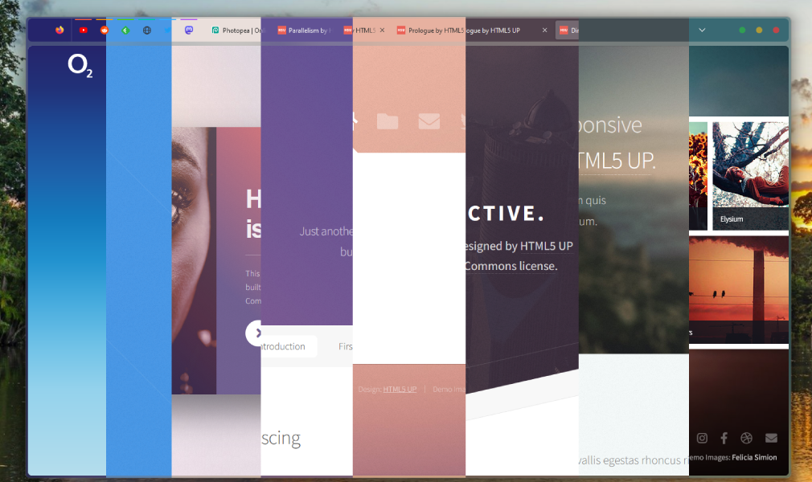
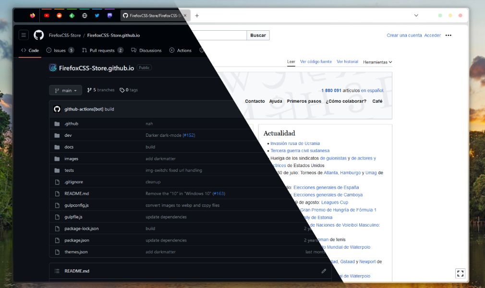
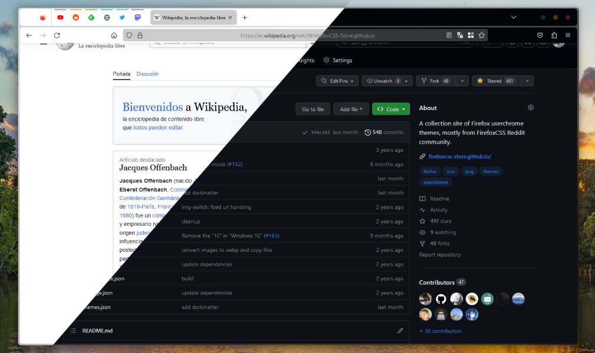

# Fox11

A Firefox CSS themes with auto-color, Mica, auto-hide nav-bar support. Inspired in [firefox-one](https://github.com/Godiesc/firefox-one) , Edge/Chrome restyle 2023.







## How to install

* [Download theme ](https://github.com/Neikon/Fox11/archive/refs/heads/main.zip)
* Open a new tab in firefox and write in url bar `about:support` you should see a list with your firefox data, You only need **"Profile folder"** , you can now click in "Open folder" button o copy the address to your profile folder.
  the address should be similar to following example depend of your system:

  * Linux - `$HOME/.mozilla/firefox/XXXXXXX.default-XXXXXX/`
  * Windows 10 - `C:\Users\<USERNAME>\AppData\Roaming\Mozilla\Firefox\Profiles\XXX.default-XXX`
  * macOS - `Users/<USERNAME>/Library/Application Support/Firefox/Profiles/XXXXXXX.default-XXXXXXX`
* Go to that folder.
* if there is no folder called `chrome`. Create it.
* Extract the contents of the zip file you downloaded in the first step into the folder `chrome

  NOTE: You only need `userchrome.css` file and `components `folder

  * it should look something like this:

  ```
  chrome/
        |- userchrome.css
        |- components
  	      |- other files
  ```
* Now go to firefox open a new tab and write `about:config` in the url bar
* A dialog will warn you, but ignore it, just do it press the `I accept the risk!` button.
* Search this `toolkit.legacyUserProfileCustomizations.stylesheets` and set to  **true** .
* Restart Firefox
* That's all, after restarting you should be seeing your new topic

## How to enable Auto-color

Download Vivaldifox [VivaldiFox from Mozilla add-ons](https://addons.mozilla.org/es/firefox/addon/vivaldifox/)

Configure Vivaldifox as the images you can find in this repository folder in [Minimal-VivaldiFox-Theme/VivaldiFox config screenshots/](https://github.com/Neikon/Minimal-VivaldiFox-Theme/tree/master/VivaldiFox%20config%20screenshots)

## How to enable Mica

1. Download the portable or installation file from [github.com/MicaForEveryone](https://github.com/MicaForEveryone/MicaForEveryone/releases).
2. Install the extra files it asks you to install. And run the program.
3. At the bottom left corner press `Add Rule` -> `Add Process Rule`, type `firefox` -> `add`.
4. On the left panel select and open `firefox` section. Change Mica to `Acrilyc` for better blur effect.
5. MicaForEveryone settings `firefox` section enable `Blur Behind` so when the window is not active it will still be blurred.
6. Dont forget to uncomment `@importurl('components/mica_support.css');` from `userChrome.css`

> Only test it in Win11

> Thanks you to [Firefox-csshacks](https://mrotherguy.github.io/firefox-csshacks/?file=) for features code
